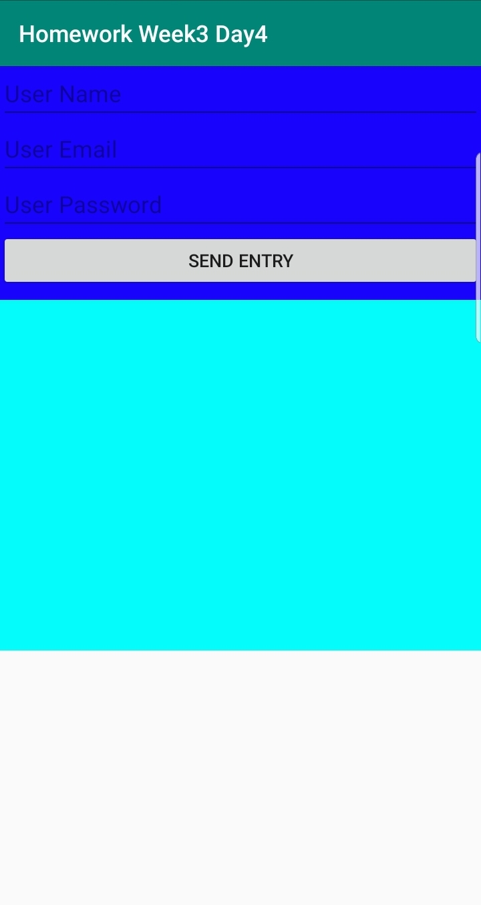

***************** Homework Week3 Day4 ****************************
1.  Create a fragment that will allow the user to input the following:
                a)  User Name
                b)  User Email
                c)  User Password
2.  On the user input fragment, have a button that will add the User to an array list in the activity
3.  In another fragment, have a recyclerView that will display the users entered in the User input fragment
4.  Both fragments should be in the same activity

Screenshot1

Screenshot2

      
